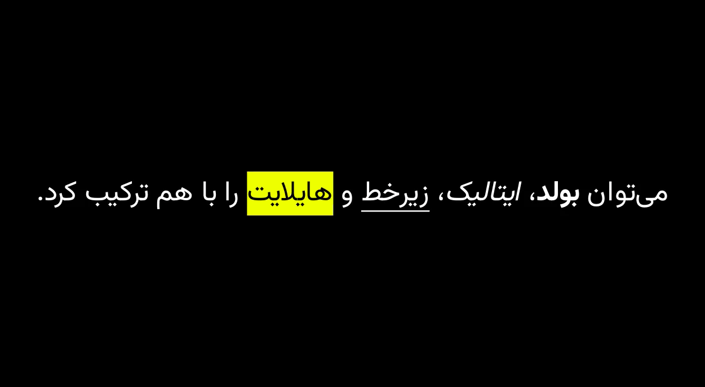

# 🎬 manim-fa

افزونه‌ی مانیم برای نمایش صحیح متن فارسی (راست‌به‌چپ)، با فونت داخلی،
تبدیل فینگلیش به فارسی، و قالب‌بندیِ بولد/ایتالیک/زیرخط/هایلایت.

## نصب

```bash
pip install -e .
```

وابستگی‌ها (`manim`, `manimpango`) به‌صورت خودکار نصب می‌شوند.

## استفاده‌ی سریع

```python
from manim import *
from manim_fa import FaText, fa_write

class Demo(Scene):
    def construct(self):
        t = FaText("به مانیم فارسی خوش آمدید!", font_size=48, color=BLUE)
        self.play(fa_write(t))   # نوشتن از راست به چپ (طبیعی برای فارسی)
        self.wait(1)
```

## قالب‌بندیِ درون‌متنی (بولد، ایتالیک، زیرخط، هایلایت)

نیازی به دانستنِ کد یا اندیسِ کاراکتر نیست — کافی است داخلِ خودِ متن از
این نشانه‌ها استفاده کنید:

| نحو | نتیجه |
|---|---|
| `**متن**` | **بولد** |
| `*متن*` | *ایتالیک* |
| `__متن__` | زیرخط‌دار |
| `==متن==` | هایلایت با رنگ پیش‌فرض (زرد) |
| `==متن\|رنگ==` | هایلایت با رنگ دلخواه، مثل `==نکته‌ی مهم\|orange==` |

```python
FaText("این متن **بولد**، این *ایتالیک*، این __زیرخط‌دار__ و این ==هایلایت== است.")



FaText("رنگ دلخواه: ==نکته‌ی مهم|orange==")
```

برای نوشتنِ خودِ نویسه‌های `*`، `_`، `=` به‌صورت عادی (بدون تفسیر به‌عنوان
قالب‌بندی)، قبلشان یک بک‌اسلش بگذارید: `\*`, `\_`, `\=`.

اگر متنِ شما به‌طور طبیعی حاویِ این نویسه‌هاست و اصلاً نمی‌خواهید تفسیر
شوند، از `markup=False` استفاده کنید:
```python
FaText("۳*۴=۱۲", markup=False)
```

### انیمیشنِ نوشتنِ راست‌به‌چپ با `fa_write`

از `fa_write(mobject)` به‌جای `Write(mobject)` استفاده کنید تا حروف از
راست به چپ (جهتِ طبیعیِ نوشتنِ فارسی) ظاهر شوند — با همان افکتِ اصیلِ
«دست‌نویسی» (اول خط‌دورِ حرف کشیده می‌شود، بعد پر می‌شود) که خودِ
`Write()` مانیم دارد؛ چون در پسِ صحنه دقیقاً از همان مکانیزم استفاده
می‌کند. تنها تفاوتش با `Write(reverse=True)` این است که با متنِ دارای
هایلایت هم درست کار می‌کند (جعبه‌ی هایلایت همیشه همراه با متنِ خودش
ظاهر می‌شود، نه با تاخیر یا جلوتر):

```python
t = FaText("این متن ==هایلایت== و **بولد** دارد.")
self.play(fa_write(t, run_time=3))
```


## 🌀 فهرست کامل انیمیشن‌های کاربردی در Manim

| نام انیمیشن | کاربرد | مثال |
|--------------|---------|-------|
| `Write()` | نوشتن تدریجی متن | `self.play(Write(t))` |
| `Create()` | رسم کامل یک شیء از ابتدا | `self.play(Create(circle))` |
| `FadeIn()` | ظاهر شدن تدریجی شیء | `self.play(FadeIn(t))` |
| `FadeOut()` | محو شدن تدریجی شیء | `self.play(FadeOut(t))` |
| `FadeToColor()` | تغییر رنگ شیء با انیمیشن نرم | `self.play(FadeToColor(t, RED))` |
| `Transform()` | تبدیل یک شیء به شیء دیگر | `self.play(Transform(t1, t2))` |
| `ReplacementTransform()` | جایگزینی تدریجی یک شیء با دیگری | `self.play(ReplacementTransform(t1, t2))` |
| `Rotate()` | چرخش شیء به اندازه مشخص | `self.play(Rotate(t, angle=PI/2))` |
| `ScaleInPlace()` | بزرگ یا کوچک شدن در محل فعلی | `self.play(t.animate.scale(1.5))` |
| `MoveAlongPath()` | حرکت شیء روی مسیر مشخص | `self.play(MoveAlongPath(t, circle))` |
| `Circumscribe()` | ترسیم حاشیه دور شیء | `self.play(Circumscribe(t))` |
| `GrowFromCenter()` | رشد شیء از مرکز | `self.play(GrowFromCenter(t))` |
| `ShrinkToCenter()` | جمع شدن شیء به مرکز | `self.play(ShrinkToCenter(t))` |
| `Wiggle()` | لرزش یا تکان نرم | `self.play(Wiggle(t))` |
| `FocusOn()` | فوکوس با تغییر نور یا رنگ | `self.play(FocusOn(t))` |
| `Flash()` | درخشش سریع در محل شیء | `self.play(Flash(t))` |
| `Indicate()` | نمایش تأکید با رنگ و مقیاس | `self.play(Indicate(t))` |
| `ApplyWave()` | حرکت موجی روی شیء | `self.play(ApplyWave(t))` |
| `ApplyMethod()` | اجرای متد خاص روی شیء | `self.play(ApplyMethod(t.shift, UP))` |
| `animate.shift()` | جابه‌جایی شیء | `self.play(t.animate.shift(UP))` |
| `animate.set_color()` | تغییر رنگ شیء | `self.play(t.animate.set_color(BLUE))` |
| `animate.rotate()` | چرخش با انیمیشن نرم | `self.play(t.animate.rotate(PI/3))` |

---

## سایر امکانات

### متن ترکیبی (فارسی + انگلیسی + عدد)
```python
FaText("این متن ترکیبی است: Hello 123 پایان.")
```

### تبدیل فینگلیش به فارسی
```python
FaText("Salam be Manim", translit=True)
```
⚠️ توجه: این تبدیل یک جایگزینیِ حرف‌به‌حرفِ ساده است، نه آوانگاری
زبان‌شناختیِ کامل. مصوت کوتاه «a» همیشه به «ا» تبدیل می‌شود، پس مثلاً
«shab» به «شاب» تبدیل می‌شود نه «شب». برای متن مهم، همیشه خروجی را
بازبینی کنید.

### فونت دلخواه
```python
FaText("سلام", font="IRTitr")  # اگر روی سیستم نصب باشد استفاده می‌شود
FaText("سلام")                  # وگرنه از فونت داخلی «وزیرمتن» استفاده می‌شود
```

## فونت همراه پلاگین

فونت [وزیرمتن (Vazirmatn)](https://github.com/rastikerdar/vazirmatn) با
مجوز SIL Open Font License 1.1 همراه پلاگین توزیع می‌شود
(`manim_fa/fonts_data/`، مجوز در همان پوشه در `OFL.txt`). این یک فونت
مدرن با پشتیبانیِ کامل OpenType برای اتصالِ حروفِ فارسی/عربی است.

## معماریِ فنی (برای مشارکت‌کنندگان)

- `manim_fa/text.py` — تابعِ `FaText`: تبدیل فینگلیش (اختیاری) ← تفسیرِ
  نشانه‌های قالب‌بندی به Pango Markup ← ساختِ `MarkupText` با فونتِ
  تضمین‌شده.
- `manim_fa/markup.py` — پارسرِ نحوِ ساده (`**`, `*`, `__`, `==`) به
  Pango Markup، با escape کردنِ نویسه‌های XML و پشتیبانی از
  بک‌اسلش‌برای‌نویسه‌ی‌خام.
- `manim_fa/fonts.py` — ثبتِ خودکارِ فونتِ داخلی نزد Pango/ManimPango و
  انتخابِ بهترین فونتِ در دسترس.
- `manim_fa/translit.py` — تبدیلِ قاعده‌مبنایِ فینگلیش به فارسی.
- `manim_fa/animation.py` — تابعِ `fa_write`: نسخه‌ی راست‌به‌چپِ
  `Write()` که فقط ترتیبِ سطحِ بالا را برعکس می‌کند (نه بازگشتی) تا هم
  افکتِ اصیلِ دست‌نویسی حفظ شود، هم هایلایت‌ها سالم بمانند.

### چرا هیچ‌جا `arabic_reshaper`/`python-bidi` استفاده نشده؟
با رندرِ واقعی و بررسیِ OCR ثابت شد که موتور متنِ خودِ مانیم (Pango +
HarfBuzz) کاملاً از الگوریتم دوجهته‌ی یونیکد و اتصالِ حروفِ فارسی/عربی
پشتیبانی می‌کند. اضافه‌کردنِ این کتابخانه‌ها باعثِ «پردازشِ دوباره» و
درنتیجه به‌هم‌ریختنِ حروف می‌شود.

### چرا `fa_write` به‌جای `Write(reverse=True)` مستقیم؟
`Write(reverse=True)` خودِ مانیم از `mobject.invert(recursive=True)`
استفاده می‌کند که ترتیبِ **همه‌ی سطوحِ تودرتو** را برعکس می‌کند، نه فقط
سطحِ بالا. این باعث می‌شد بلوکِ ادغام‌شده‌ی هایلایت (جعبه + حروفش، که در
`FaText` عمداً در یک VGroup قرار می‌گیرند) از داخل هم برعکس شود و جعبه
از متنِ خودش جدا بیفتد. به همین دلیل `fa_write` از یک زیرکلاسِ کوچک
استفاده می‌کند که فقط ترتیبِ سطحِ بالا را برعکس می‌کند (نه بازگشتی)، تا
ترتیبِ داخلیِ هر هایلایت (جعبه، سپس حروفش) همیشه دست‌نخورده بماند.

## اجرای تست‌ها

```bash
pip install pytest
pytest tests/
```

## مثال‌ها

پوشه‌ی `examples/` شامل چند صحنه‌ی نمونه است:
```bash
cd examples
manim -pql demo.py Demo
manim -pql demo_formatting.py FormattingShowcase
manim -pql demo_comparison.py Comparison
```

## محدودیت‌های شناخته‌شده

- `translit_to_fa` یک تبدیلِ تقریبی است (بالا توضیح داده شد).
- نشانه‌های قالب‌بندی (`**`, `*`, `__`, `==`) با هم تودرتو پشتیبانی
  نمی‌شوند (مثلاً بولدِ ایتالیک).
- ترکیبِ چند عبارتِ لاتین/عددیِ متوالی داخلِ یک جمله‌ی فارسی، طبقِ خودِ
  الگوریتمِ دوجهته‌ی یونیکد می‌تواند رفتارِ ظریفی داشته باشد (محدودیتِ
  خودِ استانداردِ یونیکد است، نه پلاگین).

## سازگاری

با **Manim Community v0.21.0** (جدیدترین نسخه) و **ManimPango 0.6.1**
با رندرِ واقعی تست شده است.

## مجوز
این پروژه تحت مجوز **MIT** منتشر می‌شود.
ساخته‌شده توسط علی تابش برای جامعه‌ی فارسی‌زبانِ Manim.

## 🤝 مشارکت
Pull Request یا Issue خوش‌آمد است.
